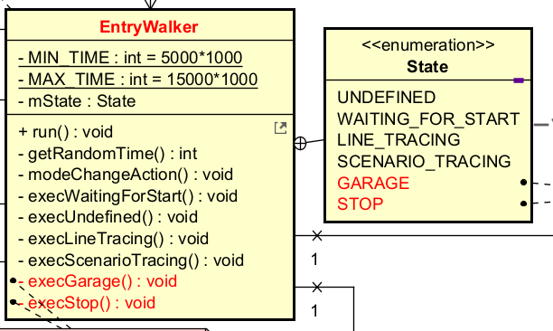

# 反復型開発 2巡目

## 要求
* 最上位クラスの名前を変更する ```RamdomWalker``` -> ```EntryWalker```

## 設計
* EntryWalker
    

    * クラス名の変更    ```RandomWalker``` -> ```EntryWalker```
        * メソッド名の一部を変更
    * 状態名の追加
        * ```GARAGE```  ガレージ走行中
        * ```STOP```    停止中
    * private メソッドの追加
        * ```execGarage()``` ガレージ走行中の処理
        * ```execStop()```   停止中の処理

## 実装
* ```RandomWalker.h```と```RandomWalker.h```をコピーして、```EntryWalker.h```と```EntryWalker.cpp```を作る
```
    $ cd workspace/Aodai2026/app
    $ cp RandomWalker.h EntryWalker.h
    $ cp RandomWalker.cpp EntryWalker.cpp
    $ cd ../../..
```
### EntryWalker.h
* インクルードガードのマクロ名を変更
```
#ifndef ETTR_APP_ENTRYWALKER_H_
#define ETTR_APP_ENTRYWALKER_H_
(途中省略)
#endif  // ETTR_APP_ENTRYWALKER_H_
```
* クラス名を変更する
```
class EntryWalker {
```

## 検証
* シミュレータを起動し、動作確認する
```
    $ make app=Aodai2026 sim up
```
* 確認事項
    * エラーチェック

