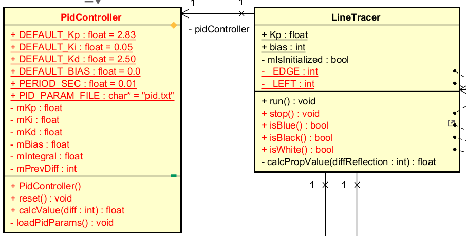

# 反復型開発 4巡目

## 要求
* PID制御クラス(```PidController```)を組込む

## 設計
* ```PidController``` クラス

    * ```LineTracer```クラスと関連
    * 関連端名 ```pidController```


## 実装
* ```unit/PidController.h```と```unit/PidController.cpp```を新規作成する
```
    $ cd workspace/Aodai2026/unit
    $ touch PidController.h
    $ touch PidController.cpp
```
### ```unit/PidController.h```
1. インクルードガード追加
```
    /**
     * PidController.h
     */
    
    #ifndef ETTR_APP_PIDCONTROLLER_H_
    #define ETTR_APP_PIDCONTROLLER_H_
    
    #endif // ETTR_APP_PIDCONTROLLER_H_
```  
  2. クラスブロック追加
```
    #ifndef ETTR_APP_PIDCONTROLLER_H_
    #define ETTR_APP_PIDCONTROLLER_H_
    
    class PidController
    {
    public:
    private:
    };
    
    #endif // ETTR_APP_PIDCONTROLLER_H_
```
  3. ```public``` なメンバ変数、関連端名、コンストラクタ、メソッド名を追加
```    
    public:
      // pid.txt が存在しない場合に使うデフォルト値
      static const float DEFAULT_Kp;           // 比例ゲインのデフォルト値
      static const float DEFAULT_Ki;           // 積分ゲインのデフォルト値
      static const float DEFAULT_Kd;           // 微分ゲインのデフォルト値
      static const float DEFAULT_BIAS;         // バイアスのデフォルト値
      static const float PERIOD_SEC;           // 周期ハンドラの周期[s]のデフォルト値
      static const char *const PID_PARAM_FILE; // PIDパラメータ設定ファイル名
      
      // コンストラクタ
      PidController();
      
      // 積分項や前回偏差などの内部状態をリセットする
      void reset();

      // 偏差からPID制御量を計算する
      float calcValue(int diffReflection);
```
  4. ```private``` なメンバ変数、関連端名、メソッド名を追加
```
    private:
      float mKp;   // 比例ゲイン
      float mKi;   // 積分ゲイン
      float mKd;   // 微分ゲイン
      float mBias; // バイアス
      
      float mIntegral;         // 積分項の値
      int mPrevDiffReflection; // 前回の偏差値
      
      void loadPidParams(); // PIDパラメータをファイルから読み込む
    };
```
### ```unit/PidController.cpp```
1. PidControllerクラスのヘッダーファイルのインクルード
  ```
  #include "PidController.h"
  ```
2. その他のヘッダファイルのインクルード
  ```
  #include <cstdio>
  #include <cstring>
  ```
3. 定数宣言と初期値の追加
  ```
  #include "PidController.h"
  #include <cstdio>
  #include <cstring>
  
  // 定数宣言
  const float PidController::DEFAULT_Kp = 2.83;
  const float PidController::DEFAULT_Ki = 0.05;
  const float PidController::DEFAULT_Kd = 2.50;
  const float PidController::DEFAULT_BIAS = 0;
  // CYC_TRACER(app.cfg)の周期と合わせること
  const float PidController::PERIOD_SEC = 0.01;
  // 実行時のカレントディレクトリ（workspaceディレクトリ）に置く
  const char *const PidController::PID_PARAM_FILE = "pid.txt";
  ```
4. コンストラクタの定義
  ```
  /**
   * コンストラクタ
   */
  PidController::PidController()
      : mKp(PidController::DEFAULT_Kp),
        mKi(PidController::DEFAULT_Ki),
        mKd(PidController::DEFAULT_Kd),
        mBias(PidController::DEFAULT_BIAS),
        mIntegral(0.0f),
        mPrevDiffReflection(0)
  {
    loadPidParams();
  }
  ```
5. メソッドの定義
  ```
  /**
   * PIDパラメータを外部ファイル（pid.txt）から読み込む
   * ファイルが無い、または項目が無い場合はデフォルト値のまま
   * ファイル書式（1行に1項目）:
   *   Kp=0.83
   *   Ki=0.02
   *   Kd=0.05
   *   bias=0
   */
  void PidController::loadPidParams() {
      FILE* fp = fopen(PidController::PID_PARAM_FILE, "r");
      if (fp == NULL) {
          printf("%s not found. use default PID parameters.\n",
                 PidController::PID_PARAM_FILE);
          return;
      }
  
      char line[64];
      while (fgets(line, sizeof(line), fp) != NULL) {
          char key[16];
          float value;
          if (sscanf(line, "%15[^=]=%f", key, &value) == 2) {
              if (strcmp(key, "Kp") == 0) {
                  mKp = value;
              } else if (strcmp(key, "Ki") == 0) {
                  mKi = value;
              } else if (strcmp(key, "Kd") == 0) {
                  mKd = value;
              } else if (strcmp(key, "bias") == 0) {
                  mBias = value;
              }
          }  
      }
      fclose(fp);
      
      printf("PID parameters loaded from %s: Kp=%f Ki=%f Kd=%f bias=%f\n",
             PidController::PID_PARAM_FILE, mKp, mKi, mKd, mBias);
  }

  /**
   * 積分項や前回偏差などの内部状態をリセットする
   */
  void PidController::reset() {
      mIntegral = 0.0f;
      mPrevDiffReflection = 0;
  }
  
  /**
   * 偏差からPID制御量を計算する
   * @param diffReflection ラインから外れた度合い（ライン閾値との差）
   */
  float PidController::calcValue(int diffReflection) {
      // P項
      float pTerm = mKp * diffReflection;
      
      // I項（誤差の積分）
      mIntegral += diffReflection * PidController::PERIOD_SEC;
      float iTerm = mKi * mIntegral;
      
      // D項（誤差の変化率）
      float derivative = (diffReflection - mPrevDiffReflection) / PidController::PERIOD_SEC;
      float dTerm = mKd * derivative;
      
      mPrevDiffReflection = diffReflection;
      
      float turn = pTerm + iTerm + dTerm + mBias;
      
      return turn;
  }
   ```
### ```Makefile.inc```
* 以下の修正 ```PidController.o```
```
APPL_CXXOBJS += \
	Walker.o \
	LineTracer.o \
	Scenario.o \
	ScenarioTracer.o \
	EntryWalker.o \
	LineMonitor.o \
	Starter.o \
	SimpleTimer.o \
	PidController.o

```

### app/LineTracer.h
* インクルードの追加
```
#include "LineMonitor.h"
#include "Walker.h"
#include "PidController.h"
```
* privateブロックに追加
```
private:
    const LineMonitor *mLineMonitor;
    Walker *mWalker;
    bool mIsInitialized;

    PidController mPidController;

    float calcPropValue(int diffReflection);
```

### app/LineTracer.cpp
1. コンストラクタの修正
```
LineTracer::LineTracer(const LineMonitor *lineMonitor, Walker *walker)
    : mLineMonitor(lineMonitor),
      mWalker(walker),
      mIsInitialized(false),
      mPidController()
{
}
```
2. run()修正
```
/**
 * ライントレースする
 */
void LineTracer::run()
{
    if (mIsInitialized == false)
    {
        mWalker->init();
        mIsInitialized = true;
        mPidController.reset();  //修正
    }

    int diffReflection = mLineMonitor->calDiffReflection();

    // 走行体の操作量を計算する
   	float turn = _EDGE * mPidController.calcValue(diffReflection);  //修正
    mWalker->setCommand(turn);

    // 走行を行う
    mWalker->run();
}
```

3. pid.txt 新規追加
  * 追加するフォルダ  simdist/Aodai2026/_ev3rtfs/pid.txt 
```
Kp=1.60
Ki=0.000
Kd=2.250
bias=0
```

## 検証

* 現状では、ライントレース走行とシナリオトレース走行をランダムに切り替えるが、暫定的にランダムの最小値・最大値を調整する
* app/EntryWalker.cpp
```
// 定数宣言
const int EntryWalker::MIN_TIME = 120 * 1000 * 1000;  // 切り替え時間の最小値
const int EntryWalker::MAX_TIME = 150 * 1000 * 1000; // 切り替え時間の最大値
```

* 確認事項
  * pid.txt の各パラメータを読み取り、実行時に表示するかどうか
  * PID制御を使ったライントレースをするかどうか
