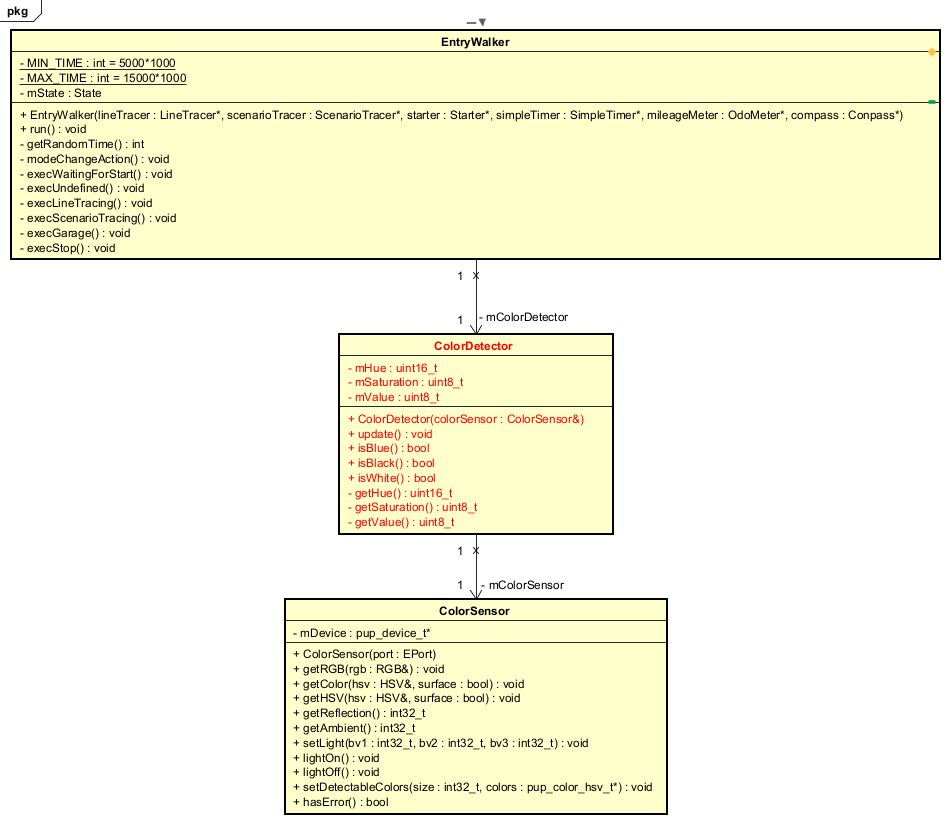

# 反復型開発 5巡目

## 要求
* 青いサークルを検知してシナリオトレースに切り替える

## 設計



* 色を検知する責務を負うColorDetectorクラスを作成
* EntryWalker -> ColorDetector -> ColorSensor と関連
* ColorSensor::getHSV()メソッドを使い、HSV色情報を取得し、ColorDetectorクラスの属性である色相(Hue), 彩度(Saturation), 明度(Value)に保存する
* 青色を判定するメソッド ColorDetector::isBlue() は、200 <= 色相 <= 260 かつ 彩度 >= 60 かつ 明度 >= 50 でtrue, それ以外はfalseとする

## 実装

### unit/ColorDetector.h
* unit/ColorDetector.h を新規作成する
```
/**
 * ColorDetector.h
 */
#ifndef ETTR_UNIT_COLORDETECTOR_H_
#define ETTR_UNIT_COLORDETECTOR_H_

#include "ColorSensor.h"

class ColorDetector {
 public:
    explicit ColorDetector(const spikeapi::ColorSensor& colorSensor);

    void update();          // HSV色情報を更新する
    bool isBlue() const;    // 青色かどうか判定する 
    bool isBlack() const;   // 黒色かどうか判定する
    bool isWhite() const;   // 白色かどうか判定する

 private:
    uint16_t mHue;          // 色相（Hue）
    uint8_t mSaturation;    // 彩度（Saturation）
    uint8_t mValue;         // 明度（Value）

    const spikeapi::ColorSensor& mColorSensor;  // 関連端名: ColorSensorの参照

    uint16_t getHue() const;        // 色相（Hue）を取得する
    uint8_t getSaturation() const;  // 彩度（Saturation）を取得する
    uint8_t getValue() const;       // 明度（Value）を取得する
};

#endif  // ETTR_UNIT_COLORDETECTOR_H_
```

### unit/ColorDetector.cpp 
* unit/ColorDetector.cpp を新規作成する
```
/**
 * ColorDetector.cpp
 */
#include "ColorDetector.h"
#include <cstdio>

/**
 * コンストラクタ
 * @param colorSensor ColorSensorの参照
 */
ColorDetector::ColorDetector(const spikeapi::ColorSensor& colorSensor)
    : mColorSensor(colorSensor) {
}

/**
 * HSV色情報を更新する
 */
void ColorDetector::update() {
    spikeapi::ColorSensor::HSV hsv;
    mColorSensor.getHSV(hsv);

    mHue = hsv.h;
    mSaturation = hsv.s;
    mValue = hsv.v;
}

/**
 * 色相（Hue）を取得する
 */
uint16_t ColorDetector::getHue() const {
    return mHue;
}

/**
 * 彩度（Saturation）を取得する
 */
uint8_t ColorDetector::getSaturation() const {
    return mSaturation;
}

/**
 * 明度（Value）を取得する
 */
uint8_t ColorDetector::getValue() const {
    return mValue;
}

/**
 * 青色かどうか判定する
 */
bool ColorDetector::isBlue() const {
    // 青色のHSV範囲を定義
    const uint16_t blueHueMin = 200;
    const uint16_t blueHueMax = 260;
    const uint8_t blueSatMin = 60;
    const uint8_t blueValMin = 50;

    printf("Hue: %d, Saturation: %d, Value: %d\n", mHue, mSaturation, mValue); // デバッグ用の出力

    return (mHue >= blueHueMin && mHue <= blueHueMax) &&
           (mSaturation >= blueSatMin) &&
           (mValue >= blueValMin);
}

bool ColorDetector::isBlack() const {
    // 黒色のHSV範囲を定義
    const uint8_t blackSatMax = 30;
    const uint8_t blackColorValMax = 30;

    return (mSaturation <= blackSatMax) &&
           (mValue <= blackColorValMax);
}

bool ColorDetector::isWhite() const {
    // 白色のHSV範囲を定義
    const uint8_t whiteSatMax = 30;
    const uint8_t whiteColorValMin = 70;

    return (mSaturation <= whiteSatMax) &&
           (mValue >= whiteColorValMin);
}
```

### Makefiel.inc
* ColorDetector.o 追加
```
# <1>
APPL_CXXOBJS += \
	Walker.o \
	LineTracer.o \
	PidController.o \
	Scenario.o \
	ScenarioTracer.o \
	EntryWalker.o \
	LineMonitor.o \
	ColorDetector.o \
	Starter.o \
	SimpleTimer.o
```

### app/EntryWalker.h
* include 追加
```
#include "Starter.h"
#include "SimpleTimer.h"
#include "ColorDetector.h"  // 追加
```

* コンストラクタにパラメータ追加
```
public:
    EntryWalker(LineTracer* lineTracer,
                ScenarioTracer* scenarioTracer,
                 const Starter* starter,
                 SimpleTimer* simpleTimer,
                 ColorDetector* colorDetector);     // 追加

```

* private の属性に追加
```
    LineTracer* mLineTracer;
    ScenarioTracer* mScenarioTracer;
    const Starter* mStarter;
    SimpleTimer* mSimpleTimer;
    ColorDetector* mColorDetector;      // 追加
    State mState;
```

### app/EntryWalker.cpp
* コンストラクタの修正
```
/**
 * コンストラクタ
 * @param lineTracer      ライントレーサ
 * @param scenarioTracer  シナリオトレーサ
 * @param starter         スタータ  
 * @param simpleTimer     タイマ
 * @param colorDetector   色検知器
 */
EntryWalker::EntryWalker(LineTracer* lineTracer,
                         ScenarioTracer* scenarioTracer,
                           const Starter* starter,
                           SimpleTimer* simpleTimer,        // 修正
                           ColorDetector* colorDetector)    // 追加
    : mLineTracer(lineTracer),
      mScenarioTracer(scenarioTracer),
      mStarter(starter),
      mSimpleTimer(simpleTimer),
      mColorDetector(colorDetector),                        // 追加
      mState(UNDEFINED) {
    spikeapi::Clock* clock = new spikeapi::Clock();

    srand(clock->now());  // 乱数をリセットする

    delete clock;
}

```

* ライントレース中の処理を修正する
```
/**
 * ライントレース状態の処理
 */
void EntryWalker::execLineTracing() {

    mColorDetector->update();           // 追加
    mLineTracer->run();

    if (mColorDetector->isBlue()) {     // 修正
        mSimpleTimer->stop();

        mState = SCENARIO_TRACING;

        modeChangeAction();
    }
}

```

### app.cpp
* オブジェクトを追加
```
// オブジェクトの定義
static Walker          *gWalker;
static LineMonitor     *gLineMonitor;
static ColorDetector   *gColorDetector;     // 追加
static Starter         *gStarter;

```

* オブジェクトの生成を追記
```
    // オブジェクトの作成
    gWalker          = new Walker(gLeftWheel,
                                  gRightWheel);
    gStarter         = new Starter(gForceSensor);
    gLineMonitor     = new LineMonitor(gColorSensor);
    gScenarioTimer   = new SimpleTimer(gClock);
    gWalkerTimer     = new SimpleTimer(gClock);
    gLineTracer      = new LineTracer(gLineMonitor, gWalker);
    gScenario        = new Scenario(0);
    gScenarioTracer  = new ScenarioTracer(gWalker,
                                          gScenario,
                                          gScenarioTimer);
    gColorDetector   = new ColorDetector(gColorSensor);     // 追加
    gEntryWalker    = new EntryWalker(gLineTracer,
                                      gScenarioTracer,
                                      gStarter,
                                      gWalkerTimer,         // 修正
                                      gColorDetector);      // 追加

```

* システム破棄に追加
```
/**
* システム破棄
 */
static void user_system_destroy() {
    gLeftWheel.stop();
    gRightWheel.stop();
    gLeftWheel.resetCount();
    gRightWheel.resetCount();

    delete gEntryWalker;
    delete gScenarioTracer;
    delete gScenario;
    delete gLineTracer;
    delete gWalkerTimer;
    delete gScenarioTimer;
    delete gLineMonitor;
    delete gColorDetector;  // 追加
    delete gStarter;
    delete gWalker;
}

```

## 検証

* 確認事項
    * 青いサークルを検知してシナリオトレースに切り替わるか確認する
