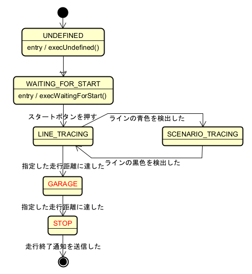

# 反復型開発 5巡目

## 要求
* 状態遷移を一部修正

## 設計
* システム全体の状態遷移

    * 状態 ```GARAGE```, ```STOP```を追加
    * 各イベントを見直し

## 実装
### ```app/EntryWalker.h```
* ```private:``` に状態名 ```GARAGE```, ```STOP``` を列挙型として追加
```
private:
    enum State
    {
        UNDEFINED,
        WAITING_FOR_START,
        LINE_TRACING,
        SCENARIO_TRACING,
        GARAGE,     // 追加
        STOP        // 追加
    };
```
* ```private:```にメソッド追加
    * ```void execGarage();```
    * ```void execStop();```

```
        void execLineTracing();
    void execScenarioTracing();
    void execGarage();  // 追加
    void execStop();    // 追加
```

### ```app/EntryWalker.cpp```

* インクルードの追加
```
#include "EntryWalker.h"
#include "etroboc_ext.h"    // 追加
```

* run()の修正
```
    switch (mState)
    {
    case UNDEFINED:
        execUndefined();
        break;
    case WAITING_FOR_START:
        execWaitingForStart();
        break;
    case LINE_TRACING:
        execLineTracing();
        break;
    case SCENARIO_TRACING:
        execScenarioTracing();
        break;
    case GARAGE:        // 追加
        execGarage();   // 追加
        break;          // 追加
    case STOP:          // 追加
        execStop();     // 追加
        break;          // 追加
    default:
        break;
    }
```

* メソッド追加
    * void EntryWalker::execGarage()
    * void EntryWalker::execStop()
```
void EntryWalker::execGarage()
{
    // 今のところ空欄、後で実装
}
```
```
void EntryWalker::execStop()
{
    ETRoboc_notifyCompletedToSimulator(); // 競技終了通知
}
```


## 検証

* 確認事項
  * pid.txt の各パラメータを読み取り、実行時に表示するかどうか
  * PID制御を使ったライントレースをするかどうか
