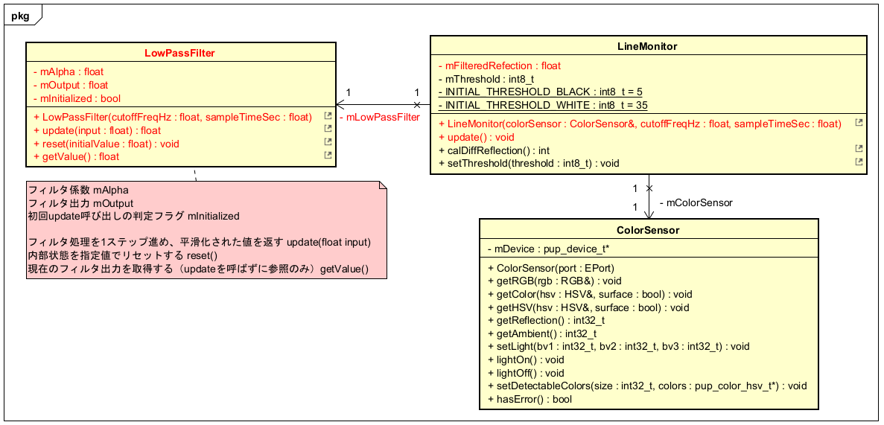

# 反復型開発 7巡目

## 要求
* ローパスフィルタを実装し、反射光を平滑化する

## 設計


## 実装

### unit/LowPassFilter.h
```
#pragma once    // インクルードガード

/// 1次IIRローパスフィルタ（指数移動平均型）
///
/// センサ値やPID微分項のノイズ除去に使用する。
/// カットオフ周波数とサンプリング周期（制御周期）から
/// 平滑化係数(alpha)を自動算出する。
///
/// y[n] = alpha * x[n] + (1 - alpha) * y[n-1]

class LowPassFilter {
public:
    /// @param cutoffFreqHz  カットオフ周波数 [Hz]
    /// @param sampleTimeSec サンプリング周期 [s]（制御周期と一致させること）
    LowPassFilter(float cutoffFreqHz, float sampleTimeSec);

    /// フィルタ処理を1ステップ進め、平滑化された値を返す
    float update(float input);

    /// 内部状態を指定値でリセットする（起動直後の飛びつき防止）
    void reset(float initialValue = 0.0);

    /// 現在のフィルタ出力を取得する（updateを呼ばずに参照のみ）
    double getValue() const { return mOutput; }

private:
    float mAlpha;        // 平滑化係数 [0,1]。大きいほど追従性が高くノイズ除去効果は弱まる
    float mOutput;       // フィルタ出力（内部状態）
    bool mInitialized;   // 初回update呼び出しの判定フラグ
};

```

### unit/LowPassFilter.cpp
```
/** 
 * LowPassFilter.cpp
 */
#include "LowPassFilter.h"

namespace {
    constexpr double TWO_PI = 6.283185307179586;
}

LowPassFilter::LowPassFilter(float cutoffFreqHz, float sampleTimeSec)
    : mAlpha(0.0f), mOutput(0.0f), mInitialized(false)
{
    // RC = 1 / (2*pi*fc),  alpha = dt / (RC + dt)
    const float rc = 1.0 / (TWO_PI * cutoffFreqHz);
    mAlpha = sampleTimeSec / (rc + sampleTimeSec);
}

float LowPassFilter::update(float input)
{
    if (!mInitialized) {
        // 起動直後にmOutput=0からの過渡応答が出るのを防ぐ
        mOutput = input;
        mInitialized = true;
        return mOutput;
    }

    mOutput = mAlpha * input + (1.0 - mAlpha) * mOutput;
    return mOutput;
}

void LowPassFilter::reset(float initialValue)
{
    mOutput = initialValue;
    mInitialized = true;
}

```

### unit/LineMonitor.h
* include 追加
```
#include "ColorSensor.h"
#include "LowPassFilter.h"  // 追加
```

* public の追加修正
```
// 定義
class LineMonitor {
public:
    LineMonitor(const spikeapi::ColorSensor& colorSensor,   // 修正
                float cutoffFreqHz = 25.0f,                 // 修正
                float sampleTimeSec = 0.01f);               // 修正

    int calDiffReflection();
    void setThreshold(int8_t threshold);
    void update();                                          // 追加
```

* private の追加修正
```
private:
    static const int8_t INITIAL_THRESHOLD_BLACK;
	static const int8_t INITIAL_THRESHOLD_WHITE;

    const spikeapi::ColorSensor& mColorSensor;  // カラーセンサの参照
    LowPassFilter mReflectionFilter;            // 追加 LPFによる反射率の平滑化
    int8_t mThreshold;                          // ライン閾値
    float mFilteredReflection;                  // 追加 平滑化された反射率
};
```

### unit/LineMonitor.cpp
* 定数の修正
```
// 定数宣言
const int8_t LineMonitor::INITIAL_THRESHOLD_BLACK = 15;  // 修正 黒色の光センサ値
const int8_t LineMonitor::INITIAL_THRESHOLD_WHITE = 25;  // 修正 白色の光センサ値
```

* コンストラクタの修正
```
/**
 * コンストラクタ
 * @param colorSensor カラーセンサ
 * @param cutoffFreqHz LPFのカットオフ周波数(Hz)
 * @param sampleTimeSec LPFのサンプリング周期(秒)
 */
LineMonitor::LineMonitor(const spikeapi::ColorSensor& colorSensor,  // 修正
                         float cutoffFreqHz, float sampleTimeSec)   // 修正
    : mColorSensor(colorSensor),
      mReflectionFilter(cutoffFreqHz, sampleTimeSec),                       // 修正
      mThreshold((INITIAL_THRESHOLD_BLACK + INITIAL_THRESHOLD_WHITE)/2),
      mFilteredReflection(0.0f) {                                           // 修正
}
```

* calDiffReflection() を修正
```
/**
 * ライン境界から外れた度合いを判定する
 * @retval ライン境界とセンサ値との差分
 */
int LineMonitor::calDiffReflection() {
    // 光センサからの取得値を見てローパスフィルタで平滑化し、
    // ライン境界の値との差分を算出して返す

    update();  // 追加 平滑化を行う
    int diff = (int)(mFilteredReflection - mThreshold);     // 修正

    return diff;
}
```

* update() 追加 
```
/**
 * 反射率の平滑化を行う
 */
void LineMonitor::update() {
    // 光センサからの取得値を見て
    // 反射率の平滑化を行う
    mFilteredReflection = mReflectionFilter.update(mColorSensor.getReflection());
}
```

### Makefile.inc
* LowPassFilter.o 追記
```
APPL_CXXOBJS += \
	Walker.o \
	LineTracer.o \
	PidController.o \
	Scenario.o \
	ScenarioTracer.o \
	EntryWalker.o \
	LineMonitor.o \
	ColorDetector.o \
	Starter.o \
	SimpleTimer.o \
	LowPassFilter.o
```

### app.cpp
* コンストラクタの修正
```
    // オブジェクトの作成
    gWalker          = new Walker(gLeftWheel,
                                  gRightWheel);
    gStarter         = new Starter(gForceSensor);
    gLineMonitor     = new LineMonitor(gColorSensor, 25.0f, 0.01f); // 修正
    gScenarioTimer   = new SimpleTimer(gClock);

```

## 検証

* 確認事項
    * コンストラクタのcutoff周波数の値を調整し、平滑化の度合いを調整する（～50.0f）